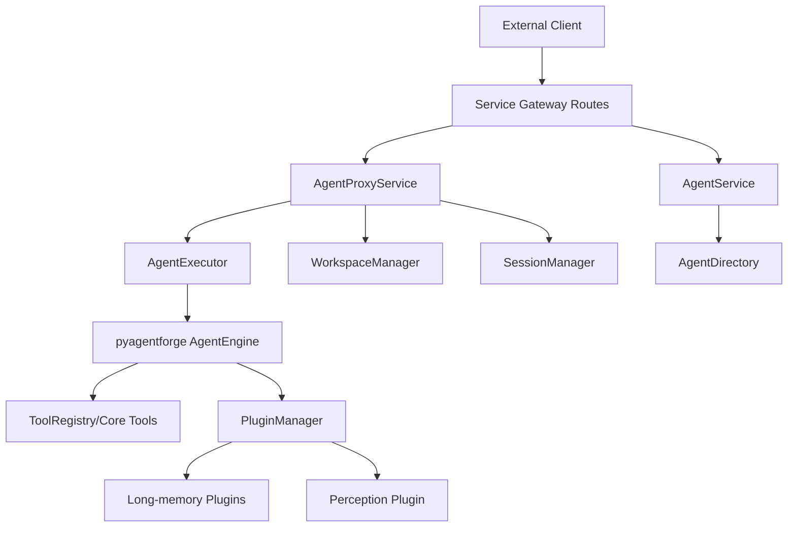

# `main/` 目录结构解析与开发导航

## 1. 文档信息
- 扫描路径: `D:\localproject\1.project\work\NeuroForge\main`
- 生成日期: 2026-03-23
- 目标: 提供可落地的目录说明、模块边界与开发切入导航

## 2. 顶层总览

### 2.1 一级目录与定位
- `agentforge-engine/`: 核心引擎与插件生态（仓库最大模块）
- `Service/`: FastAPI 网关与服务编排层
- `Long-memory/`: 长记忆相关插件（向量化 + 语义检索）
- `Agent/`: Agent 资产（定义、模板、子代理、工具）
- `perception/`: 主动感知插件（日志解析 + 策略决策）
- `Docs/`: 项目级文档与规范
- 根配置文件: `.env*`、`llm_config*.json`、`CONFIG_GUIDE.md`、`llm_config_schema.json`

### 2.2 规模画像（排除 `__pycache__`/`.pytest_cache`）
| 模块 | 文件数 | `.py` | `test_*.py` | 说明 |
|---|---:|---:|---:|---|
| `agentforge-engine` | 441 | 385 | 69 | 引擎核心 + 插件系统 |
| `Service` | 59 | 45 | 5 | API 层 + 服务层 |
| `Long-memory` | 63 | 44 | 7 | 记忆插件链路 |
| `Agent` | 47 | 25 | 1 | Agent 定义资产 |
| `perception` | 17 | 14 | 5 | 感知/决策插件 |
| `Docs` | 6 | 0 | 0 | 文档资源 |

## 3. 核心模块解析

### 3.1 `agentforge-engine/`

#### 3.1.1 角色
PyAgentForge 内核，负责模型调用、工具执行、插件装配、上下文管理、自动化与代码搜索能力。

#### 3.1.2 关键入口
- `pyagentforge/__init__.py`
  - 暴露 `LLMClient`
  - 暴露 `create_engine()` / `create_minimal_engine()`
  - 统一导出 Kernel / Tool / Plugin 能力
- `pyagentforge/client.py`
  - 基于 `api_type` 适配协议请求
  - 通过 `ModelRegistry` 解析模型配置

#### 3.1.3 主要子目录
- `pyagentforge/kernel/`: 核心执行抽象（engine/executor/message/model_registry）
- `pyagentforge/tools/`: 工具体系（注册、权限、builtin 工具）
- `pyagentforge/plugins/`: 插件生态
  - `integration/`: 业务编排能力（如 `chain_of_thought`、`task_system`）
  - `middleware/`: 中间件能力（如 error recovery、context lifecycle）
  - `tools/`: 工具型插件（如 `ast_grep`）
- `pyagentforge/capabilities/`: 渠道能力（`webchat`、`webhook`）
- `pyagentforge/codesearch/`: 代码检索/索引能力
- `tests/`: 引擎测试总集（kernel/core/plugin/tools/integration 等）
- `data/commands/`: 命令模板数据
- `data/skills/`: 技能资源（例如 code-review、git-commit）

#### 3.1.4 特征
- 插件权重高（`plugins` 文件量最高）
- 工具和中间件分层清晰
- 测试分区完整，适合按域回归

---

### 3.2 `Service/`

#### 3.2.1 角色
作为外部调用入口，负责 HTTP API、请求路由、服务注册、会话/工作区代理执行。

#### 3.2.2 关键入口
- `gateway/app.py`
  - 应用工厂 + lifespan
  - 注册服务: `agent`、`proxy`、`model_config`
  - 装配路由到 `/api/v1`

#### 3.2.3 路由分层（`gateway/routes/`）
- `health.py`: 健康检查与根路径
- `tools.py`: 工具列表与执行
- `agents.py`: Agent 查询与执行、Plan 路由
- `models.py`: 模型配置 CRUD、统计
- `proxy.py`: 工作区/会话/执行/流式执行

#### 3.2.4 服务分层（`services/`）
- `agent_service.py`: 对接 `AgentDirectory` 与 agent 执行
- `model_config_service.py`: 模型配置管理
- `proxy/agent_proxy_service.py`: proxy 主服务
- `proxy/agent_executor.py`: 会话内 agent 执行器
- `proxy/workspace_manager.py`: 路径与工具权限隔离
- `proxy/session_manager.py`: 会话状态与历史管理

#### 3.2.5 其他层
- `schemas/`: API 请求/响应模型
- `core/registry.py`: 服务注册中心
- `config/settings.py`: 服务配置
- `docs/`: 按 API 域拆分文档（00/01/02/03/04/05/99）
- `tests/`: service 层测试

---

### 3.3 `Long-memory/`

#### 3.3.1 角色
提供“向量化 + 长期记忆存储/检索”的插件能力。

#### 3.3.2 子模块
- `embeddings/`
  - 插件 ID: `tool.local-embeddings`
  - 主要文件: `PLUGIN.py`, `embeddings_provider.py`, `config.py`
  - 内置本地模型目录: `models/all-MiniLM-L6-v2/`
- `long-memory/`
  - 插件 ID: `tool.long-memory`
  - 依赖: `tool.local-embeddings`
  - 主要文件: `PLUGIN.py`, `vector_store.py`, `config.py`, `models.py`
  - `tools/`: memory_store/search/delete/list
  - `memory_processor/`: 记忆处理链路
  - `super_compress/`: 压缩摘要链路
  - `middleware/`: 自动记忆中间件
  - `tests/`: 插件与向量存储测试

#### 3.3.3 特征
- 明确的插件依赖关系（底层 embeddings -> 上层 long-memory）
- 具备可独立测试目录

---

### 3.4 `Agent/`

#### 3.4.1 角色
管理 Agent 元数据与资产模板，不直接承担核心推理执行。

#### 3.4.2 核心目录
- `core/config.py`: Agent 基础配置读取
- `core/directory.py`: 目录扫描与 AgentInfo 装配（识别 `agent.yaml` + `system_prompt.md`）
- `mate-agent/`: 元代理资产中心
  - `subagents/`: analyzer/builder/modifier/tester 等
  - `templates/`: `simple-agent`/`reasoning-agent`/`tool-agent`
  - `tools/`: `analysis`、`config`、`crud`、`system`
- `active-agent/`, `passive-agent/`: 示例/默认 Agent
- `config.yaml`: Agent 平台配置
- `tests/test_spawn_subagent.py`: 当前可见测试入口

#### 3.4.3 特征
- “文件资产驱动”的 Agent 管理方式
- 模板与工具分层，适合扩展 agent 生成流程

---

### 3.5 `perception/`

#### 3.5.1 角色
基于日志格式（ATON/TOON）进行感知、过滤、策略决策与执行触发。

#### 3.5.2 关键文件
- `PLUGIN.py`: 插件入口
  - 插件 ID: `integration.perception`
  - 内含告警去重器 `AlertDeduplicator`
- `detector.py`: 格式识别
- `parser.py`: 日志解析
- `perception.py`: 感知决策
- `strategy.py`: 策略控制
- `executor.py`: 执行逻辑
- `tools.py`: 对外工具封装
- `tests/`: 感知链路测试

#### 3.5.3 特征
- 结构紧凑、单模块自治
- 对日志驱动流程友好

## 4. 统一配置层（`main/` 根）

### 4.1 LLM 配置文件族
- `llm_config.json`
- `llm_config.template.json`
- `default_llm_config.json`
- `llm_config_simple.json`
- `llm_config_schema.json`
- `CONFIG_GUIDE.md` / `JSON_CONFIG_README.md`

### 4.2 配置模型
采用“模型级配置”思路：
- 每个模型节点声明 `api_type/base_url/model_name/api_key(_env)/headers/timeout`
- schema 定义支持多种 `api_type`（如 openai-completions、openai-responses、anthropic-messages 等）

## 5. 跨模块调用关系

## 6. 开发任务场景导航图（重点）

### 场景 1: 新增/修改 API 接口
1. 路由层: `main/Service/gateway/routes/*.py`
2. 协议模型: `main/Service/schemas/*.py`
3. 业务实现: `main/Service/services/*.py` 或 `main/Service/services/proxy/*.py`
4. 应用挂载确认: `main/Service/gateway/app.py`
5. 测试: `main/Service/tests/`

建议起点:
- 若是 Agent 查询类接口，从 `routes/agents.py` + `services/agent_service.py` 开始
- 若是会话执行类接口，从 `routes/proxy.py` + `services/proxy/agent_proxy_service.py` 开始

### 场景 2: 调整 Agent 定义加载或 Agent 列表行为
1. `main/Agent/core/directory.py`（扫描逻辑）
2. `main/Agent/core/config.py`（排除目录/基础配置）
3. `main/Service/services/agent_service.py`（对外暴露与执行）
4. 验证 `main/Agent/*/agent.yaml`

### 场景 3: 新增一个引擎插件（integration/tool/middleware）
1. 选择落位:
   - integration: `main/agentforge-engine/pyagentforge/plugins/integration/`
   - middleware: `.../plugins/middleware/`
   - tools: `.../plugins/tools/`
2. 参考现有 `PLUGIN.py` 结构实现 metadata + 生命周期 + tools
3. 若需在业务服务中可见，确认 Service 层加载配置链路
4. 补测试到对应插件 `tests/`（若已有）或引擎 `tests/integration` / `tests/plugin`

### 场景 4: 接入新模型或调整模型配置
1. 先改 `main/llm_config*.json`（建议从 `llm_config.template.json` 复制）
2. 校验字段与 `main/llm_config_schema.json` 一致
3. 引擎调用链核对:
   - `pyagentforge/client.py`
   - `pyagentforge/kernel/model_registry.py`
4. Service 层模型接口核对:
   - `main/Service/services/model_config_service.py`
   - `main/Service/gateway/routes/models.py`

### 场景 5: 排查“为什么工具权限/路径权限被拒绝”
1. `main/Service/services/proxy/workspace_manager.py`
2. `main/Service/services/proxy/permission_bridge.py`
3. `main/Service/services/proxy/agent_executor.py`（工具过滤 + 权限 checker 注入）
4. 请求入口 `main/Service/gateway/routes/proxy.py`

### 场景 6: 增强长期记忆效果（召回、压缩、存储）
1. 向量化质量: `main/Long-memory/embeddings/embeddings_provider.py`
2. 检索/存储策略: `main/Long-memory/long-memory/vector_store.py`
3. 工具行为: `main/Long-memory/long-memory/tools/*.py`
4. 处理/压缩链路:
   - `memory_processor/*`
   - `super_compress/*`

### 场景 7: 优化日志感知策略（告警去重、触发策略）
1. `main/perception/PLUGIN.py`（去重、插件生命周期）
2. `main/perception/perception.py`（决策逻辑）
3. `main/perception/strategy.py`（策略控制）
4. 回归测试: `main/perception/tests/*.py`

### 场景 8: 需要快速定位“执行链路问题”（从请求到模型）
1. `Service/gateway/routes/proxy.py`（HTTP 入口）
2. `Service/services/proxy/agent_proxy_service.py`（会话与执行调度）
3. `Service/services/proxy/agent_executor.py`（engine 初始化与 run）
4. `agentforge-engine/pyagentforge/kernel/engine.py`（核心执行）
5. `agentforge-engine/pyagentforge/client.py`（模型请求）

## 7. 测试与验证建议（按模块）
- 引擎层:
  - `cd main/agentforge-engine && pytest -v --tb=short`
- Service 层:
  - `cd main/Service && pytest tests/ -v --cov=Service --cov-report=html`
- Long-memory:
  - `cd main/Long-memory/long-memory && pytest`
- perception:
  - `cd main/perception && py -m pytest tests/ -v`

## 8. 结构层面的观察与整理建议
1. 版本标记需统一: `pyproject.toml` 与 `pyagentforge/__init__.py` 的版本号存在差异。
2. 建议清理或忽略缓存产物: `__pycache__`、`.pytest_cache`、`.pyc`。
3. `main/Long-memory/long-memory/=0.4.22` 看起来是安装日志残留文件，建议评估是否应移除。
4. 如果后续要做架构文档化，可把本文件拆成:
   - `00-overview.md`
   - `10-runtime-flow.md`
   - `20-dev-playbook.md`

---

如果要继续落地，我建议下一步补两份文档:
- `main/Docs/service-request-lifecycle.md`（单次请求完整时序）
- `main/Docs/plugin-authoring-checklist.md`（新插件开发检查清单）
