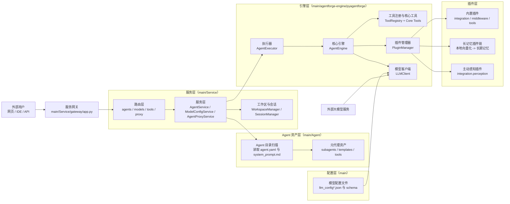

```mermaid
flowchart LR
  用户["外部用户<br/>网页 / IDE / API"] --> 网关["服务网关<br/>main/Service/gateway/app.py"]

  subgraph 服务层["服务层（main/Service）"]
    路由["路由层<br/>agents / models / tools / proxy"]
    服务["服务层<br/>AgentService / ModelConfigService / AgentProxyService"]
    会话["工作区与会话<br/>WorkspaceManager / SessionManager"]
  end

  网关 --> 路由 --> 服务
  服务 --> 会话

  subgraph 资产层["Agent 资产层（main/Agent）"]
    目录["Agent 目录扫描<br/>读取 agent.yaml 与 system_prompt.md"]
    元代理["元代理资产<br/>subagents / templates / tools"]
  end

  服务 --> 目录 --> 元代理

  subgraph 引擎层["引擎层（main/agentforge-engine/pyagentforge）"]
    执行器["执行器<br/>AgentExecutor"]
    引擎["核心引擎<br/>AgentEngine"]
    工具["工具注册与核心工具<br/>ToolRegistry + Core Tools"]
    插件管理["插件管理器<br/>PluginManager"]
    模型客户端["模型客户端<br/>LLMClient"]
  end

  服务 --> 执行器 --> 引擎
  引擎 --> 工具
  引擎 --> 插件管理
  引擎 --> 模型客户端

  subgraph 插件层["插件层"]
    内置插件["内置插件<br/>integration / middleware / tools"]
    长记忆插件["长记忆插件链<br/>本地向量化 -> 长期记忆"]
    感知插件["主动感知插件<br/>integration.perception"]
  end

  插件管理 --> 内置插件
  插件管理 --> 长记忆插件
  插件管理 --> 感知插件

  subgraph 配置层["配置层（main）"]
    模型配置["模型配置文件<br/>llm_config*.json 与 schema"]
  end

  模型配置 --> 模型客户端
  外部模型["外部大模型服务"] --> 模型客户端
```
